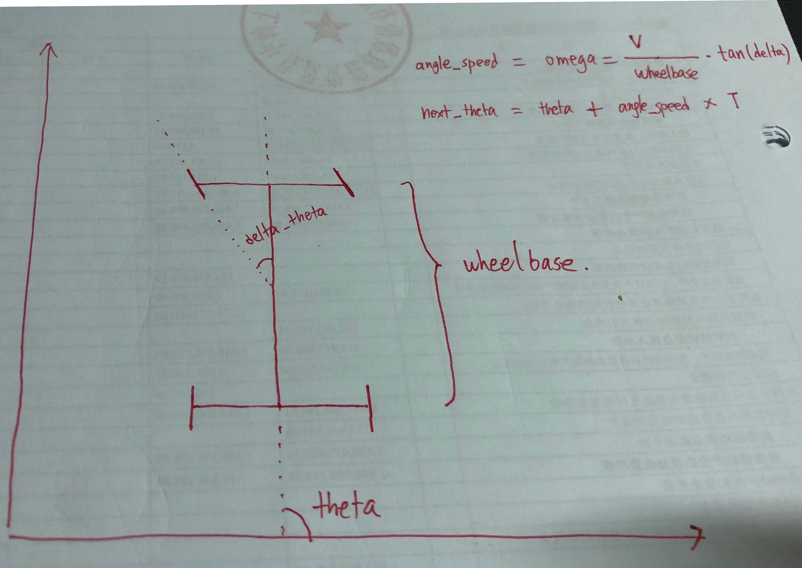
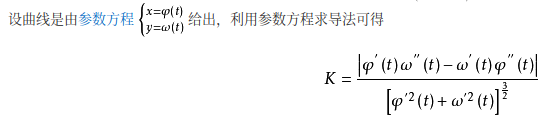

# English:

## Problem
In urban scenario, we often need do U-Turn, this repo aims to design a trajectory generator, it can generate a trajectory with each point have position and smooth curve, and this trajectory can be used by car to do a U-Turn

Input：Two lane in a U-Turn scenario, each lane contains center line, and each center line contains sequence of pose{x,y,theta,kappa}

Output：A trajectory can connect two lane

## Solution：

Use A-Star to find drivable trajectory. Need notice that when our space is descreted, the path comes out from A-Star is not drivable, because it's not smooth and doesn't concern car motion model, for example car's maximum turn radius. For solve that issue, the Hybrid-A-Star solution comes out. In Hybrid-A-Star solution, we count car's motion model into search algorithm, make sure each step of search(exploration) is under constraint of motion model.

Rough compute process is:

1. Use motion model as a constraint to compute the next reachable position(Grid) in A-Star
    1. when we use motion model，HeuristicCost also need optimized according to U-turn scenario
2. Delete not drivable position(Grid)（Obstacle, Out of map,...）
3. Each reachable position we get corresponding descreted grid position and continuity position, and we stitch them together
4. After we finished searching, we get all continuity position（x，y，theta）
5. Check whether the (x,y,theta) meet the smooth condition(mainly curve smoothing)
6. Some visualization
    1. python module:matplotlib
7. About the test, I didn't bring in heavy test framework such as gtest，boost test and so on，I use shell scripts and c++ assert as a light weight solution， because when we were developing, we need execute the program again and again to confirm out code is work, and at the same time we need visualization, so I try to combine visualization and debugging together to help myself to speed up my developing. And use C++ to write test is harder to do visualization, and each changes in visualization all need re-compile.

### How to use my code:

1. Build：

    ```shell
    cd /path/to/U-Turn-Solution
    mkdir build
    cd build
    cmake ..
    make
    cd ..
    ```

2. Run test and display result：

    ```shell
    # test single data and visualize one
    ./test_and_viz_one.sh ./test_data/lane_data_1.txt
    # batch test all data and generate image
    ./test_all_and_quiet.sh
    ```
    **test data lane_data.3.txt is a very wired test data, its not a U-Turn scenario, so the result seems not very good.**

    **Example output**:

    

3. About inner parameters：

    I use command-line args(1~7 parameters you need care about)：

    ```c++
        // load planner config from command line
        twx_algo::MotionConfig motion_config = {
            argc > 1 && argv[1] != NULL ? std::stod(argv[1]) : 1.0,  // desired_speed or A-Star simulation speed
            argc > 2 && argv[2] != NULL ? std::stod(argv[2]) : 4.5,  // ego car wheelbase
            argc > 3 && argv[3] != NULL ? std::stod(argv[3]) : 40.0, // max steering angle
            argc > 4 && argv[4] != NULL ? std::stod(argv[4]) : -40}; // min steering angle

        twx_algo::hybrid_a_star::SearchConfig search_config = {
            argc > 5 && argv[5] != NULL ? std::stod(argv[5]) : 20.0, // explore steering angle step
            argc > 6 && argv[6] != NULL ? std::stod(argv[6]) : 1.0}; // time duration each exploration
    ```

    the 7th parameter is the environment data, the two lanes of a U-Turn：

    ```c++
        if (argc > 7 && argv[7] != NULL)
        {
            lane_data_file_name = argv[7];
            std::ifstream lane_stream(argv[7], std::ifstream::in);
            ...
        }
    ```

    this is a example when I try to manually launch the binary：

    ```shell
        ./build/u_turn_planner_test 1.0 3 40 -40 40 1.0 ./test_data/lane_data.txt
    ```

4. Project folder:

```text
./test //entry file
./test_data //test data and result images

```

### Some key point：

1. Why called Hybrid-A-Star，‘Hybrid‘ means the path searching process is under constraint of motion model. That futher means in grid map, each exploration step, we can only reach the position where the car can reach.

2. I didn't use traditional 3-d array in A-Star to descrete position, I designed a more elegant way:

    ```c++
    std::vector<std::map<Point, State>>
    ```

    this way is like a sparse matrix， it's not space consuming as 3-d array and we don't need do position to index conversion with this structure. Only one thing we need implement is the Point comparator and hasher.
3. Car's motion model：
    
    Code：
    ```c++
        double delta = M_PI * steering / 180.0;
        double omega = motion_config_.desired_speed / motion_config_.wheelbase * std::tan(delta);

        double next_theta = theta + omega * search_config_.time_step;
        double next_x = x + motion_config_.desired_speed * std::cos(theta) * search_config_.time_step;
        double next_y = y + motion_config_.desired_speed * std::sin(theta) * search_config_.time_step;
    ```
4. Final trajectory need to be re-sample，for more smooth and reach the condition of compute kappa
    I compute kappa by this fomular：

    

## Other possible solution 1:

Generate half circle curve as reference line, then use some control method to let the car follow the reference line.
Weakness is the half circle may not possible for a cat to drive.

## Other possible solution 2：

Use target lane entrance as the end-configuration space，then use Jerk minimal optimization method to compute the trajectory，then check the validation of the trajectory. This method also didn't concern motion model, so car may not follow the trajectory perfectly, this is the basic code for the Jerk minimal optimization：

```c++
/**
 * jerk-minimized trajectory solver
 * @param start Init configuration
 * @param end Final configuration
 * @return JMT params
 */
TrajectoryParams generate_jerk_minimized_trajectory(
    const TrajectoryReference &start,
    const TrajectoryReference &end
) {
    TrajectoryParams trajectory_params;

    trajectory_params.T = end.timestamp - start.timestamp;

    // rectify round trip behavior:
    double rectified_start_s = start.s;
    double rectified_end_s = end.s;
    if (rectified_start_s > rectified_end_s) {
        rectified_start_s -= 6945.554;
    }

    trajectory_params.s = solve_jerk_minimized_trajectory(
        rectified_start_s, start.vs, start.as,
          rectified_end_s,   end.vs,   end.as,
        trajectory_params.T
    );
    trajectory_params.d = solve_jerk_minimized_trajectory(
        start.d, start.vd, start.ad,
          end.d,   end.vd,   end.ad,
        trajectory_params.T
    );

    return trajectory_params;
}
std::vector<double> solve_jerk_minimized_trajectory(
    double x0, double vx0, double ax0,
    double x1, double vx1, double ax1,
    double T
) {
    // pre-computed exponentials of T:
    std::vector<double> T_exp{1.0, T, pow(T, 2.0), pow(T, 3.0),pow(T, 4.0), pow(T, 5.0)};

    // system matrix:
    Eigen::MatrixXd A(3, 3);
    A <<   T_exp[3],    T_exp[4],    T_exp[5],
         3*T_exp[2],  4*T_exp[3],  5*T_exp[4],
         6*T_exp[1], 12*T_exp[2], 20*T_exp[3];

    // desired output:
    Eigen::VectorXd b(3);

    b <<  x1 - (x0 + vx0*T_exp[1] + 0.5*ax0*T_exp[2]),
         vx1 - (vx0 + ax0*T_exp[1]),
         ax1 - ax0;

    // polynomial coefficients:
    Eigen::VectorXd coeffs = A.colPivHouseholderQr().solve(b);

    return {x0, vx0, 0.5*ax0, coeffs(0), coeffs(1), coeffs(2)};
}
```

# 中文:

## 问题描述
在城市道路驾驶中，我们经常会遇到需要车辆掉头的场景，请设计并实现一个轨迹生成类(一个或者几个class/struct组成)，能够生成一条位置、曲率平滑的轨迹，让车辆能够完成掉头运动。

输入：需要完成掉头的两条车道的中心线数据，中心线的每个点数据包含位置与朝向（x,y,theta）


输出：连接两条车道的完整轨迹，轨迹中每个点包含位置、朝向与曲率数据（x,y,theta,kappa）


## 方案：
使用A-Star来寻找可行驶轨迹。在离散的情况下A-Star给出的路径不是可行驶的，但是当我们加入汽车的动力学约束后，也许可以达到题目要求的结果。

1. 使用动力学约束来计算A-Star的可扩展区域（格子）
    1. 约束动力学模型的同时，HeuristicCost也需要根据U-Turn的场景进行适当的优化
2. 删除不合理的区域（碰到障碍物，地图外，效率低等）
3. 记录连续的车辆状态以及状态关联的离散格子
4. 待得到搜索结果后取出路径相关联的连续状态数据（x，y，theta）
5. 检查曲率是否平滑
6. 可视化
    1. 可视化部分使用python的matplotlib
7. 测试代码部分并没有引入测试框架（gtest，boosttest等），而是用脚本配合c++ assert的轻量化方案， 因为开发和测试过程中需要很多肉眼观测的辅助和
批量的测试文件读取，使用c++对代码维护要求较高， 而且无法做到和代码不耦合的可视化。

### 程序使用说明：

1. 构建：

    ```shell
    cd /path/to/U-Turn-Solution
    mkdir build
    cd build
    cmake ..
    make
    cd ..
    ```

2. 运行测试脚本：

    ```shell
    # 测试单个数据并可视化
    ./test_and_viz_one.sh ./test_data/lane_data_1.txt
    # 批量测试所有数据集
    ./test_all_and_quiet.sh
    ```
    **测试数据中的lane_data.3.txt是通过不了测试的，因为我给的数据中两个lane之间的距离过长， 可以试试把程序的第一个参数放大到5以上，但是效果不是很好，针对这种长距离的规划我这边还需要优化。**

    **样例输出**:

    

3. 参数说明：

    本程序采用命令行参数传递的形式设置参数，参数设置方法可参照：
    第1~6个参数：

    ```c++
        // load planner config from command line
        twx_algo::MotionConfig motion_config = {
            argc > 1 && argv[1] != NULL ? std::stod(argv[1]) : 1.0,  // desired_speed or a-star simulation speed
            argc > 2 && argv[2] != NULL ? std::stod(argv[2]) : 4.5,  // ego car wheelbase
            argc > 3 && argv[3] != NULL ? std::stod(argv[3]) : 40.0, // max steering angle
            argc > 4 && argv[4] != NULL ? std::stod(argv[4]) : -40}; // min steering angle

        twx_algo::hybrid_a_star::SearchConfig search_config = {
            argc > 5 && argv[5] != NULL ? std::stod(argv[5]) : 20.0, // explore steering angle step
            argc > 6 && argv[6] != NULL ? std::stod(argv[6]) : 1.0}; // time duration each exploration
    ```

    第7个参数为环境信息即lane数据：

    ```c++
        if (argc > 7 && argv[7] != NULL)
        {
            lane_data_file_name = argv[7];
            std::ifstream lane_stream(argv[7], std::ifstream::in);
            ...
        }
    ```

    所以在我的测试脚本中我是这么做的：

    ```shell
        ./build/u_turn_planner_test 1.0 3 40 -40 40 1.0 ./test_data/lane_data.txt
    ```
4. 文件夹说明:
```
./test //可执行程序入口代码
./test_data //测试数据和可视化结果

```

### 方案1关键技术解释：
1. 路径搜索使用了Hybrid A Star，‘Hybrid‘意味着路径搜索过程结合了车辆运动模型。也就是在grid map中每向前走一步，都只搜索车辆可到达的区域。

2. A Star中没有使用3维数组形式的真栅各地图，而是:

    ```c++
    std::vector<std::map<Point, State>>
    ```

    该形式有点像稀疏矩阵的表达方式， 大大节约了空间消耗，也大大减轻的坐标系转换的工作。
3. 车辆运动模型为：
    
    相关代码：
    ```c++
        double delta = M_PI * steering / 180.0;
        double omega = motion_config_.desired_speed / motion_config_.wheelbase * std::tan(delta);

        double next_theta = theta + omega * search_config_.time_step;
        double next_x = x + motion_config_.desired_speed * std::cos(theta) * search_config_.time_step;
        double next_y = y + motion_config_.desired_speed * std::sin(theta) * search_config_.time_step;
    ```
4. 最终的轨迹经过了拟合以及重采样，为了让轨迹是平滑的，同时也是为了计算kappa
    kappa的计算根据该公式得出：
    


## 其他可能的方案1:

生成半圆曲线作为reference line, 然后使用qp进行优化。
该方法没有比较合理的壁障方案。

## 其他可能的方案2：

使用目标lane的入口作为end-configuration space，然后使用Jerk minimize直接求解汽车可执行轨迹，然后检查轨迹是超过边界或存在碰撞。该方法可能导致计算出的trajectory不满足车子的物理特性，比如某些点的curve过大。下面给出一个最简单的JMT实现：

```c++
/**
 * jerk-minimized trajectory solver
 * @param start Init configuration
 * @param end Final configuration
 * @return JMT params
 */
TrajectoryParams generate_jerk_minimized_trajectory(
    const TrajectoryReference &start,
    const TrajectoryReference &end
) {
    TrajectoryParams trajectory_params;

    trajectory_params.T = end.timestamp - start.timestamp;

    // rectify round trip behavior:
    double rectified_start_s = start.s;
    double rectified_end_s = end.s;
    if (rectified_start_s > rectified_end_s) {
        rectified_start_s -= 6945.554;
    }

    trajectory_params.s = solve_jerk_minimized_trajectory(
        rectified_start_s, start.vs, start.as,
          rectified_end_s,   end.vs,   end.as,
        trajectory_params.T
    );
    trajectory_params.d = solve_jerk_minimized_trajectory(
        start.d, start.vd, start.ad,
          end.d,   end.vd,   end.ad,
        trajectory_params.T
    );

    return trajectory_params;
}
std::vector<double> solve_jerk_minimized_trajectory(
    double x0, double vx0, double ax0,
    double x1, double vx1, double ax1,
    double T
) {
    // pre-computed exponentials of T:
    std::vector<double> T_exp{1.0, T, pow(T, 2.0), pow(T, 3.0),pow(T, 4.0), pow(T, 5.0)};

    // system matrix:
    Eigen::MatrixXd A(3, 3);
    A <<   T_exp[3],    T_exp[4],    T_exp[5],
         3*T_exp[2],  4*T_exp[3],  5*T_exp[4],
         6*T_exp[1], 12*T_exp[2], 20*T_exp[3];

    // desired output:
    Eigen::VectorXd b(3);

    b <<  x1 - (x0 + vx0*T_exp[1] + 0.5*ax0*T_exp[2]),
         vx1 - (vx0 + ax0*T_exp[1]),
         ax1 - ax0;

    // polynomial coefficients:
    Eigen::VectorXd coeffs = A.colPivHouseholderQr().solve(b);

    return {x0, vx0, 0.5*ax0, coeffs(0), coeffs(1), coeffs(2)};
}
```
